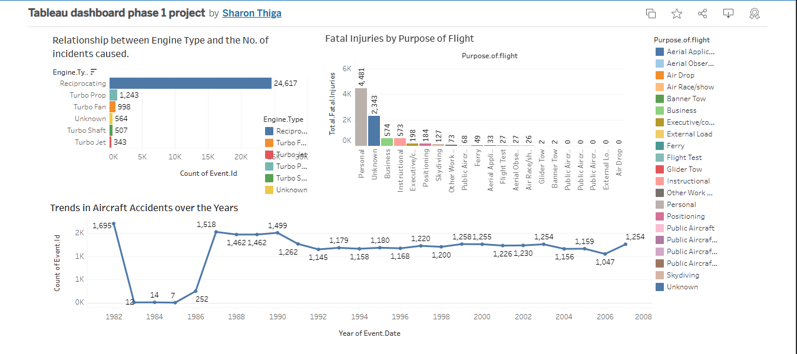

# Phase-1-Project

## Project Title: Choosing the safest Aircraft for a new aviation business.

### Project Overview
  - This project aims to provide actionable insights to an aviation company expanding into the avaition industry interested in purchasing and operating airplanes for commercial and private enterprises.
  - The goal is to help the head of the new aviation division decide which aircraft to purchase for successful business operations.

### Business Problem
 
 The company does not know anything about the potential risks of aircrafts making it difficult to make informed purchasing decisions to determine which aircrafts are the safest options.

### Project Goals and Objectives;
  
  1.To analyze aviation accident data to identify airacrafts suitable for the business.
  
  2.To provide data driven recommendations for aircraft selection.
  
  3.To provide the business stakeholders with findings for how the business should move forward with the new aviation opportunity.
  
  4.Analyze the impact of weather conditions on Aircraft damage.

### Data Source
The dataset used for analysis is from the National Transportation safety board that includes accident data from 1962-2023 with records of civil aviation accidents and selected incidents in the United States and international waters.

## Analysis Approach

### 1. Data Cleaning
```python
df.isna().sum() #I used this code to output the number of missing values in each column in the dataset.
```
#### Dealing with missing values 
- Handling missing values using imputation techniques such as Median and Mode using fillna() for both numerical and categorical columns that had fewer missing values. Example;
```python
avi_df['Total.Uninjured'].fillna(avi_df['Total.Uninjured'].median(), inplace=True) # numerical column
avi_df['Country'].fillna(avi_df['Country'].mode()[0],inplace=True) #categorical column
```
- Using fillna() to fill  NaN values with 'Unknown'. Example below;
```python
avi_df['Report.Status'].fillna('Unknown', inplace=True) # NaN values in Report.Status column filled with Unknown.
```
- Removing unnecessary columns that had a large number of missing values using drop()
- Removing remaining missing values from rows using dropna()

### 2. Using groupby()
This method helps summarize data using various columns. Example;
```python
avi_df.groupby('Weather.Condition')['Aircraft.damage'].count() #outputs which weather condition had the most number of aircraft damages.
avi_df.groupby('Engine.Type')['Event.Id'].count() #outputs the engine type that caused the most incidents.
```

### 3. Data Visualization
- Use of matplotlib and seaborn to make various conclusions.
- Refer to my notebook to check out for the visualizations. **[view full notebook](index.ipynb)**
##### Tableau dashboard
Here is a representation of an interactive dashboard from Tableau to get more visual insights from the dataset.
 

Click on this link below to explore the dashbaord.
**[View interactive dashboard](https://public.tableau.com/app/profile/sharon.thiga/viz/Tableaudashboardphase1project/Dashboard1?publish=yes)**

## Findings and Recomendations
- Based on analysis, the following recoomendations are provided to help guide the company's decisions.


